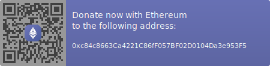

# Freelance Developer and GFX Artist
I take on development projects and am currently taking commissions to create sprites, pixel-art, retro style graphics, and animations. I can be reached at [Email](mailto:HaroldPetersInskipp@gmail.com)

### I have experience with the following
#### Languages
---

#### Frameworks Platforms and Libraries
---

#### Applications
---

#### Databases and Networking
---

#### Operating Systems
---

## A fun new 🛠 project 🛠 is being worked on in secret, often in the dark. A demo is available that you can download from [📁HERE📁](https://github.com/HaroldPetersInskipp/GameDemo)

 - If you enjoy any of my works or want to contribute to future projects you can show support by ❤ donating ❤

